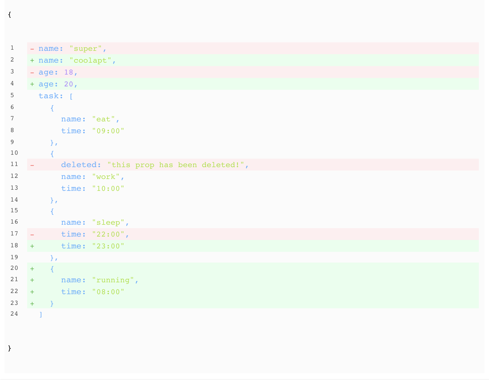

# vue-json-compare

[](https://github.com/5SSS/vue-json-compare)

A vue(2.x) components for compare Object or Array

## Links

- [Github](https://github.com/5SSS/vue-json-compare)

## Install

```js
npm install --save vue-json-compare
```

## Usage

```html
<template>
  <div>
    <vue-json-compare :oldData="oldData" :newData="newData"></vue-json-compare>
  </div>
</template>
```

```js
import vueJsonCompare from 'vue-json-compare';
const oldData = {
  name: 'super',
  age: 18,
  task: [
    { name: 'eat', time: '09:00' },
    { name: 'work', time: '10:00', deleted: 'this prop has been deleted!' },
    { name: 'sleep', time: '22:00' },
  ],
};
const newData = {
  name: 'coolapt',
  age: 20,
  task: [
    { name: 'eat', time: '09:00' },
    { name: 'work', time: '10:00' },
    { name: 'sleep', time: '23:00' },
    { name: 'running', time: '08:00' },
  ],
};
export default {
  components: {
    vueJsonCompare,
  },
  data() {
    return {
      oldData: oldData,
      newData: newData,
    };
  },
};
```

## Result



## Props

| Attribute | Level | Description | Type                                          | Default |
| --------- | ----- | ----------- | --------------------------------------------- | ------- |
| oldData   | basic | json data   | object or object Array, {...}, [{...}, {...}] | -       |
| newData   | basic | json data   | object or object Array, {...}, [{...}, {...}] | -       |

## Events

not yet...

## PS

如果喜欢请给个星星，谢谢。
If you like, please give me a star, thank you.

如果需要帮助: QQ:1573815240 邮箱: 1573815240@qq.com
if you need help: QQ:1573815240 email: 1573815240@qq.com
